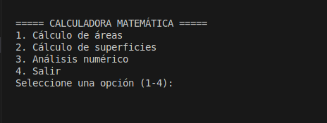

# Ejercicio_Practico_Integrador

## INTEGRANTES

- Juan David Gamboa
- Jorge Alberto Gomez
- Victor Alfonso Guzman

## ESTRUCTURA DE PROYECTO

Ejercicio_Practico_Integrador/
│
├── analisisNumerico/              # Algoritmos y funciones principales

│   ├── __init__.py                 # Archivo que gestiona el submenú para elegir el análisis

│   ├── factorial.py                # Función para calcular el factorial de un número

│   ├── fibonacci.py                # Función para generar la secuencia de Fibonacci

│   ├── numeros_amigos.py           # Función para verificar si dos números son amigos

│   ├── numeros_perfectos.py        # Función para verificar si un número es perfecto

│   ├── pi.py                       # Función para aproximar el valor de pi

│
├── areas/                          # Cálculos de áreas y geometría

│   ├── __pycache__/                # Caché de Python (archivos compilados)

│   ├── funciones/                  # Funciones matemáticas y geométricas

│   │   ├── __init__.py             # Inicializador de funciones

│   │   ├── circulo.py              # Función para calcular el área de un círculo

│   │   ├── cuadrado.py             # Función para calcular el área de un cuadrado

│   │   ├── menu.py                 # Menú de selección de áreas

│   │   ├── poligono.py             # Función para calcular el área de un polígono

│   │   └── triangulo.py            # Función para calcular el área de un triángulo

│   │
├── modules/                        # Módulos adicionales con funcionalidades auxiliares

│   └── utils.py                    # Funciones utilitarias (por ejemplo, para cálculos comunes)

│
├── superficies/                    # Superficies geométricas

│   ├── __init__.py                 # Inicializador del paquete superficies

│   ├── circulo.py                  # Cálculo de la superficie de un círculo

│   ├── cuadrado.py                 # Cálculo de la superficie de un cuadrado

│   ├── poligono.py                 # Cálculo de la superficie de un polígono

│   ├── triangulo.py                # Cálculo de la superficie de un triángulo

│   └── main.py                     # Archivo principal para ejecutar el cálculo de superficies

│
├── README.md                       # Documentación del proyecto

## PANTALLAZO INICIAL DE LA APLICACION 

